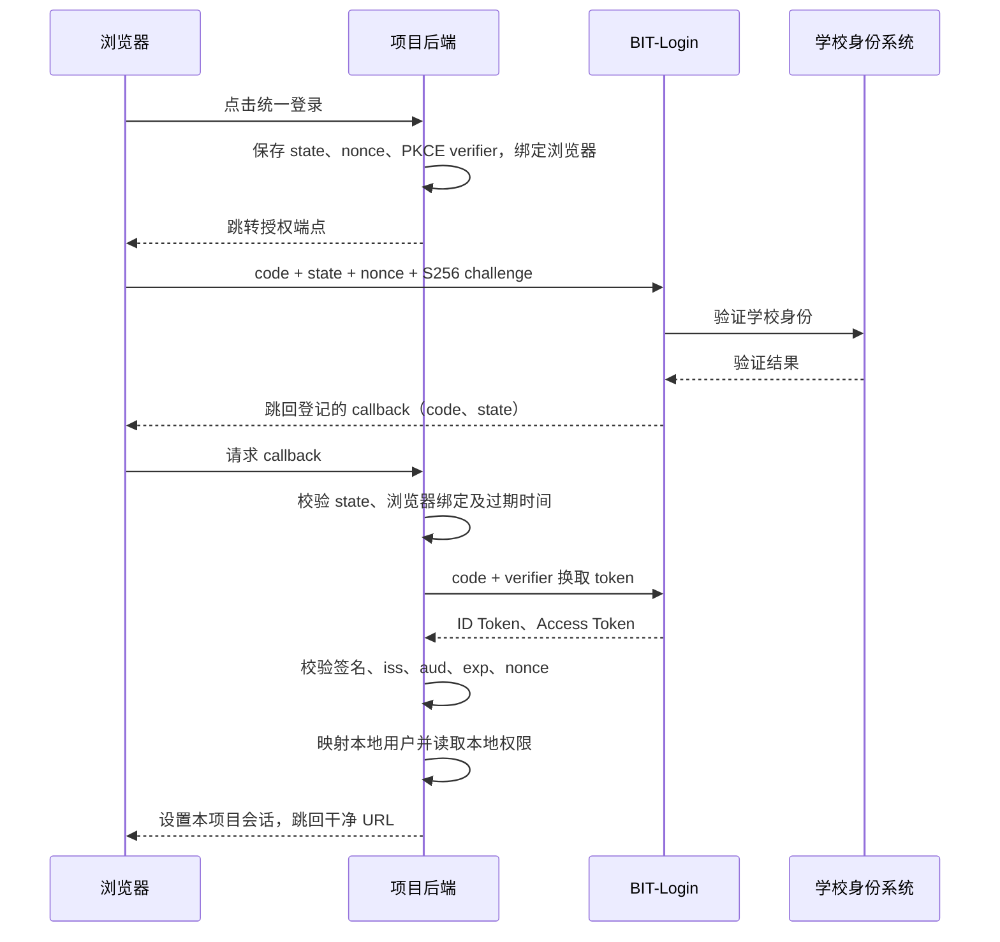

# BIT-Login 统一登录项目接入说明

适用对象：需要通过学校身份认证登录的 Web 项目开发者及部署维护人员。本文依据当前 identity-only OIDC 实现编写（2026-10-04），示例域名、编号和客户端名称均为占位值，不代表真实部署。

BIT-Login 验证学校身份，向接入项目提供 `sub`、`student_id` 和学校上游返回的 `name`。接入项目自行决定该身份是否可以使用本系统，以及用户的角色、业务口、管理员权限和启用状态。

## 1. 接入前先了解当前能力

| 项目 | 当前实现 |
|---|---|
| 登录协议 | OpenID Connect（OIDC），Authorization Code |
| PKCE | 必须使用 `S256` |
| 请求关联 | 必须携带 `state` 和 `nonce` |
| Scope | 必须同时请求 `openid student_id`，不支持额外 scope |
| Token 端点客户端认证 | `none`（public client），不使用 client secret |
| ID Token 签名 | `RS256`；通过 JWKS 获取公钥 |
| 回调方式 | 浏览器 GET，参数放在 query 中 |
| 业务身份字段 | `sub`、`student_id`、`name` |
| 应用登记 | 每个网关实例配置一个 Client ID 和对应的精确回调白名单 |
| Refresh Token / 静默续期 | 未实现 |
| 动态客户端登记 / Token introspection / 标准撤销端点 | 未实现 |
| OIDC 单点退出 / 跨应用免登录会话 | 未实现，不能仅因支持 OIDC 就假定具备这些能力 |

服务支持多个已登记应用；每个 `client_id` 有独立的回调白名单和 token 有效期。未配置 `OIDC_APPLICATIONS` 时仍兼容旧的单客户端环境变量。管理工作台“应用接入”展示每个应用的配置和有效期，不会在线创建新的客户端。

其他项目接入时，可为项目部署独立的网关实例，分配独立 Client ID、issuer（独立域名或端口）、签名密钥、数据目录和服务任务。若希望多个项目共用一个 issuer，应先实现并测试多客户端登记与隔离，使授权码、token audience、回调白名单均绑定到各自客户端。不要直接复用报销 OA 的 Client ID 并追加其他项目回调；这不能提供独立的客户端隔离。

## 2. 身份与权限的职责

| BIT-Login 负责 | 接入项目负责 |
|---|---|
| 对接学校上游，验证身份 | 维护本地用户和启用状态 |
| 提供经验证的 `sub`、`student_id` 和上游认证的 `name` | 按学工号预配置访问权限，按需使用姓名作显示 |
| 签发短期 ID Token、Access Token | 管理角色、业务口、管理员和业务数据 |
| 验证 PKCE、回调白名单，限制授权码使用 | 校验 ID Token，创建并维护本项目会话 |
| 网关黑名单及网关管理员工作台 | 本项目禁用账号、权限变更和会话失效 |

网关返回学校上游认证的姓名，但不返回角色、业务口、额度、报销记录或其他业务资料。接入项目不得根据 `name` 授权或绑定身份；姓名变化时应按项目规则更新显示名称。ID Token 还包含 OIDC 必需的 `iss`、`aud`、`iat`、`exp`、`nonce` 等协议字段。

网关管理员与项目管理员是两个独立权限体系。能进入网关 `/admin` 不代表能管理 OA；项目也不能根据身份声明中的姓名或角色自行提权。

## 3. 提交接入登记信息

向网关维护人员提供以下表格，不需要提供任何学校账号密码：

| 字段 | 示例 | 要求 |
|---|---|---|
| 项目名称 | 示例业务系统 | 明确项目及维护联系人 |
| 环境 | 测试 / 生产 | 分别登记，避免混用 |
| 项目入口 | `https://app.example.edu` | 用户浏览器可访问 |
| Client ID | `example-app` | 由维护人员确认分配 |
| 回调 URL | `https://app.example.edu/api/auth/oidc/callback` | 协议、主机、端口、路径、尾斜杠均精确匹配；不用通配符 |
| Scope | `openid student_id` | 不附加 `profile`、`email`、`offline_access` |
| Token 认证方式 | `none` | PKCE public client，无 client secret |
| 身份映射字段 | `student_id` | 本地用户表的学工号保持字符串格式；`name` 只作可选显示名称 |
| 后端所在网络 | 项目部署网段 | 后端必须能访问 discovery、token、JWKS；按需访问 UserInfo |
| 本地账号策略 | 预创建账号，未知或停用账号拒绝 | 权限由项目配置，不自动授予管理员 |

维护人员确认实例分配后，返回 issuer、Client ID、已登记的精确回调和公开接入清单。已授权网关管理员可从 `/admin/export/oidc.json` 或 `/admin/export/oidc.md` 导出公开协议元数据。公开分享前检查清单中的内网地址和项目入口是否适合公开；不要附带真实服务器配置或管理员列表。

## 4. 项目侧配置

下面使用报销 OA 客户端采用的环境变量名称；其他框架将相同值映射到其 OIDC 配置项即可：

```dotenv
AUTH_PROVIDER=oidc
OIDC_ISSUER=https://login.example.edu
OIDC_CLIENT_ID=example-app
OIDC_CLIENT_AUTH_METHOD=none
OIDC_CALLBACK_URL=https://app.example.edu/api/auth/oidc/callback
OIDC_USERNAME_CLAIM=student_id
OIDC_SCOPE=openid student_id
OIDC_PROVIDER_NAME=统一身份认证
```

不要配置 `OIDC_CLIENT_SECRET`，也不要向 Token 端点发送 Basic Authorization。Access Token 调用 UserInfo 时使用的 Bearer Authorization 则是必需的。

浏览器访问项目入口和网关授权页面；**项目后端**访问 discovery、Token、JWKS。只有浏览器能访问网关，登录仍无法完成。issuer 必须与 discovery 和 ID Token 的 `iss` 一致，不要把后端的 issuer 擅自替换为另一个 loopback 地址。

生产使用 HTTPS。校内 HTTP 试运行没有传输加密，仅使用专门测试身份；是否接受私网 HTTP 取决于客户端库的配置，不应关闭整个 TLS 校验来迁就部署。网关的 OIDC 签名私钥与 HTTPS 证书私钥用途不同，两者均无需提供给接入项目。

## 5. 登录流程



### 5.1 从 discovery 获取端点

请求 `GET {issuer}/.well-known/openid-configuration`，核对返回的 `issuer` 后读取端点。以下路径用于识别当前实现，项目应优先使用客户端库的 discovery：

| 用途 | 方法 / 路径 |
|---|---|
| Discovery | `GET /.well-known/openid-configuration` |
| 用户登录授权 | `GET /oauth/authorize` |
| 授权码换 token | `POST /oauth/token` |
| 公钥 | `GET /jwks` |
| 可选身份查询 | `GET /oauth/userinfo` |

### 5.2 发起授权

由后端为每次登录生成新的随机 `state`、`nonce`、`code_verifier`。推荐对 32 字节密码学安全随机数做无 padding 的 base64url 编码；其 43 字符输出适用于当前服务端。verifier 必须满足 RFC 7636 的 43–128 字符要求。

计算 `code_challenge = BASE64URL(SHA256(ASCII(code_verifier)))`，不带 `=` padding。将原始 verifier、nonce、state 放入有过期时间的服务端存储，并用 HttpOnly cookie 绑定发起登录的浏览器。使用每次登录独立的记录，避免多个标签页相互覆盖。回调采用跨站 GET 时，绑定 cookie 通常用 `SameSite=Lax`；HTTPS 下设置 `Secure`。

浏览器跳转参数如下，所有值需正确 URL 编码：

```text
response_type=code
client_id=example-app
redirect_uri=https://app.example.edu/api/auth/oidc/callback
scope=openid student_id
state=<本次随机值>
nonce=<本次随机值>
code_challenge=<本次 S256 计算结果>
code_challenge_method=S256
```

学校密码、短信验证码等只在网关页面处理。接入项目不收集、不转发、不保存它们；不要把 `/oauth/login`、验证码和轮询路由当作项目登录 API 调用。

### 5.3 处理回调与换取 token

后端先检查回调参数类型和唯一性、state 是否存在且未过期、是否与浏览器绑定，再消费该登录记录一次。遇到 `error` 应结束本次流程，不创建会话；缺少或不匹配 state 的错误回调也不能放行。拒绝重复参数、重复回调及伪造浏览器绑定。

向 discovery 返回的 Token 端点发送 `application/x-www-form-urlencoded` POST：

```text
grant_type=authorization_code
client_id=example-app
code=<本次授权码>
redirect_uri=https://app.example.edu/api/auth/oidc/callback
code_verifier=<保存在服务端的原始 verifier>
```

成功响应包含 `access_token`、`token_type=Bearer`、`expires_in`、`scope=openid student_id` 和 `id_token`。没有 refresh token。授权流程默认 300 秒、授权码 60 秒；token 与 ID Token 默认有效期 7 天，并按应用独立配置，以响应及 token 的 `exp` 为准。有效期由统一登录服务签发并签名，应用仍应在本地会话中执行自己的过期和退出策略。授权码只能成功兑换一次，失败时重新发起登录，不反复重放旧回调。

### 5.4 验证 ID Token

使用维护中的 OIDC 客户端库完成 token 验证；只做 JWT base64 解码不能证明身份。至少验证：

1. 使用预期 issuer 的 JWKS 按 `kid` 选公钥，校验 `RS256` 签名，拒绝未允许的算法。
2. `iss` 与配置的 issuer 精确一致；`aud` 面向本项目 Client ID，多 audience 时由库校验 `azp` 等规则。
3. `exp` 未过期，`iat` 等时间声明合理；服务器保持时间同步，并限制时钟偏差容忍值。
4. `nonce` 与本次服务端存储值一致；它不能用回调传入的任意值替代。
5. `sub` 和 `student_id` 均为有效的非空字符串。保持学工号前导零，不做数值转换；若存在 `name`，按字符串读取并限制展示长度。

当前实现 `sub` 与 `student_id` 相同；项目仍应分别处理协议主标识与本地映射字段，避免未来身份源变更时把二者当作永远相同的约定。

Access Token 是供网关 UserInfo 使用的不透明凭证，不能当成项目自己的 API 登录凭证，也不能当 JWT 自行解码。需要 UserInfo 时发送 `Authorization: Bearer <access_token>`；返回内容应类似以下虚构例子，并校验其 `sub` 与已验证 ID Token 一致：

```json
{ "sub": "TEST000001", "student_id": "TEST000001", "name": "测试用户" }
```

ID Token 已满足身份映射需求时，不必额外查询 UserInfo。token 留在后端，不写入 localStorage、项目 URL、访问日志或错误报告。

## 6. 本地用户映射与会话

推荐流程如下，`verifiedClaims` 必须来自上一节已完成的校验：

```text
identity = 查找本地身份绑定(verifiedClaims.iss, verifiedClaims.sub)
如果已有绑定：读取该绑定的本地用户
否则：按 verifiedClaims.student_id 查找预先创建的本地用户
若用户不存在或已停用：拒绝登录，不创建用户、不授予权限
在事务中保存首次身份绑定，设置唯一约束防止并发重复绑定
从本地数据库读取角色和业务范围
将 verifiedClaims.name 作为可选显示名称；缺失时回退显示学工号
创建新的随机项目会话，设置 HttpOnly cookie
清理登录流程及 cookie，重定向到不含 code/state 的项目 URL
```

建议绑定键使用 `(issuer, sub)`，并约束同一 issuer 下同一本地用户的绑定唯一性。已有绑定的学工号发生变化时，按项目制度显式处理，不根据姓名猜测用户，不自动转移权限。

OIDC 模式下，管理员创建账号应以学工号、角色、业务范围和启用状态为主，不强制设置本地密码。显示名称可使用已验证的 `name`，也可回退显示学工号；姓名不能决定角色或管理员权限。保留本地模式用于受控回滚的项目，应关闭 OIDC 模式下的本地密码登录入口；无本地密码的 OIDC 账号回滚后也不应获得默认密码。

项目退出登录时销毁自己的服务端会话并清除 cookie。网关重启或黑名单变更不会自动注销已创建的项目会话；项目需要自行定义会话有效期、禁用检查与权限变更后的会话失效策略。当前没有跨项目单点退出。

## 7. 网关维护人员如何登记

先确认本实例是否已经服务其他项目。新项目使用独立实例时，在该实例本地配置以下环境变量；以下仅为配置模板：

```dotenv
IDENTITY_ONLY=true
OIDC_ISSUER=https://login.example.edu
OIDC_CLIENT_ID=example-app
OIDC_REDIRECT_URIS=https://app.example.edu/api/auth/oidc/callback
```

在 Windows 部署脚本中，issuer、Client ID 和回调分别对应本地 `oidc-settings.ps1` 的 `Issuer`、`ClientId`、`RedirectUris`。同步配置独立监听地址/端口、任务、数据目录和签名密钥路径；不复制别的项目的真实管理员名单或私钥。详情见 [部署与证书说明](oidc-pilot.md)。

配置变更后重启对应实例，重新检查 discovery、JWKS 和授权参数。重启会使内存中的进行中登录、授权码、Access Token 及管理员会话失效；已经签出的 ID Token 在密钥仍受信任时可有效到其到期时间，项目既有会话也不会自动消失。调整回调应在切换时协调进行，验收后移除不再使用的地址。

## 8. 接入验收

先完成无需真实学校密码的测试，再使用专门测试身份做端到端联调。合成 token 和 mock 身份源只用于隔离测试环境，不能把生产网关改成信任任意学工号。

| 验收项 | 预期结果 |
|---|---|
| 从项目后端读取 discovery、JWKS | HTTP 200，issuer、算法、端点与登记一致；JWKS 无私钥参数 |
| 无 token 访问 UserInfo | HTTP 401 |
| 无效授权码请求 Token 端点 | HTTP 400，不返回任何 token；证明网络和路由可达，不代表成功登录 |
| 错误 Client ID / 未登记回调 | 拒绝请求；不跳转到攻击者地址 |
| 缺少 state、nonce 或 S256 PKCE | 拒绝请求 |
| 额外请求 `profile` 或缺少 `student_id` scope | `invalid_scope` |
| 错误 state / 浏览器 cookie / 已过期或重复回调 | 不创建项目会话 |
| 错误 nonce、签名、issuer、audience、过期 ID Token | 不创建项目会话 |
| 错误 verifier / 重用已兑换授权码 | 换取 token 失败 |
| 已映射且启用的测试用户 | 登录成功，返回 `sub`、`student_id` 和学校认证的 `name`，只获得本项目数据库中的权限 |
| 未建本地账号或本地账号停用 | 拒绝登录，不自动创建账号 |
| 测试声明中夹带 admin、角色或业务口 | 不改变项目权限 |
| 匿名访问业务 API / 普通用户访问管理 API | 分别返回未认证 / 禁止访问 |
| 日志及浏览器跳转完成后的 URL | 不含学校密码、code、token、会话 cookie 或完整身份声明 |

反向代理和应用访问日志应对回调 query 做脱敏或关闭该路径访问日志。健康检查返回基础状态，不返回环境变量或账号表。

## 9. 常见问题

| 现象 | 优先检查 |
|---|---|
| 浏览器能打开网关，回调仍失败或超时 | 项目后端到 discovery / Token / JWKS 的路由、防火墙、TLS 信任 |
| `invalid_client` | Client ID 是否对应本实例；是否误发了 client secret 或 Basic Authorization |
| `Unregistered redirect_uri` | 协议、端口、路径、尾斜杠是否精确匹配，配置变更后是否已重启 |
| `invalid_scope` | 必须且仅请求 `openid student_id` |
| `invalid_grant` | code 是否超时/重复，verifier、Client ID、redirect_uri 是否与原请求一致；账号是否被网关禁用 |
| nonce / state 校验失败 | 会话 cookie、回调 SameSite 行为、负载均衡下流程存储共享、并发标签页 |
| 签名校验失败 | issuer / `kid` / JWKS 缓存和密钥变更；不要通过关闭签名校验解决 |
| 认证成功但项目拒绝进入 | 本地学工号是否预配置、账号是否启用、身份绑定是否冲突；姓名只能影响显示 |
| 登录成功但缺少 `name` | 网关是否使用已登记的门户回调和 `OIDC_UPSTREAM_CLIENT_ID`；不要从回调 URL 的 `name` 参数猜测姓名 |
| 切换 issuer 后无法识别旧用户 | 先制定显式映射迁移策略并核对学工号唯一性；不要只按姓名关联 |

## 10. 相关文档和实现参考

- [网关部署、工作台与 HTTPS 证书](oidc-pilot.md)
- [来源与安全边界](source-and-security.md)
- [协议路由实现](../bit-login-server/src/main/kotlin/cn/bit101/bitlogin/server/oidc/OidcRoutes.kt)
- [配置项与有效期](../bit-login-server/src/main/kotlin/cn/bit101/bitlogin/server/oidc/OidcConfig.kt)
- [授权码和 PKCE 校验](../bit-login-server/src/main/kotlin/cn/bit101/bitlogin/server/oidc/OidcGrantStore.kt)

旧版 SDK / REST 业务查询 API 属于另一种运行模式，identity-only 模式不挂载这些业务路由。接入统一登录的项目使用本文 OIDC 合约即可。
